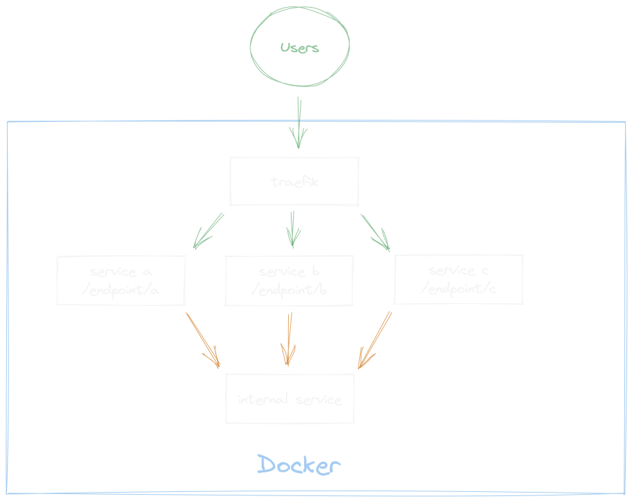

For the last project at work I used Traefik as the entrypoint for the whole stack on Docker. It totally would make sense to use an api gateway in this case but Traefik does the job quite nice and is easy to spin up within the stack. This is the reason why I wrote this article to show you how Traefik is configured in this scenario.

## Overview

This is a simple overview of the stack (created with [Excalidraw](https://excalidraw.com/)).

Three services are customer faced (green arrows) and one is only reachable within the stack (orange arrows). The one service (orange) that is only reachable internally is used to check if the given app token on each request of an user is valid. Yes, nearly every endpoint is protected by an app token.
Theoretically the services can also be reached directly within the stack but we still use Traefik even for internal communication.
